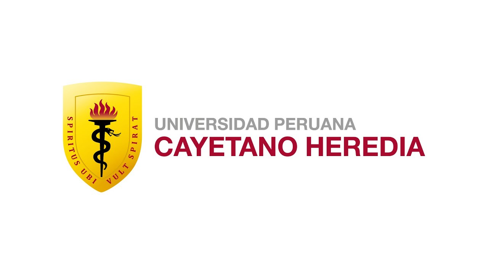

<table>
<tr>
<td>

</td>
<td>

<h1>🚀 Equipo 04 — Procesos de Innovación de Ingeniería</h1>

<b>Ingeniería Industrial e Ingeniería Informática</b> 
<i>Universidad Peruana Cayetano Heredia (UPCH) • 2026-2</i>

</td>
</tr>
</table>

---

  
  
  

s