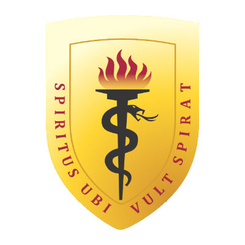

<table>
<tr>
<td>

</td>
<td>

<h1>🚀 Equipo 04 — Procesos de Innovación de Ingeniería</h1>

<b>Ingeniería Industrial e Ingeniería Informática</b><br>
<i>Universidad Peruana Cayetano Heredia (UPCH) • 2026-2</i>

</td>
</tr>
</table>

---

<p align="center">
  
  
  
</p>
---

## 📋 Tabla de Contenidos

- [🌎 Descripción del Equipo](#-descripción-del-equipo)
- [🎯 Objetivo](#-objetivo)
- [🌱 Alineación con los ODS](#-alineación-con-los-ods)
- [👥 Equipo Multidisciplinario](#-equipo-multidisciplinario)
- [🔄 Metodología de Trabajo](#-metodología-de-trabajo)
- [📁 Estructura del Repositorio](#-estructura-del-repositorio)
- [🛠️ Tecnologías y Herramientas](#️-tecnologías-y-herramientas)
- [📬 Información Académica](#-contacto-e-institución)
- [✨ Colaboradores](#-colaboradores)

---
## 🌎 Descripción del Equipo

> 💡 **Enfoque del equipo:** Trabajamos de manera colaborativa para desarrollar soluciones innovadoras mediante el uso de herramientas de ingeniería y tecnología.

Somos el **Equipo 04** del curso de **Procesos de Innovación de Ingeniería** de la **Universidad Peruana Cayetano Heredia (UPCH)**. Nuestro equipo está conformado por estudiantes de **Ingeniería Industrial e Ingeniería Informática**, lo que nos permite integrar diferentes conocimientos y perspectivas para abordar problemas y desarrollar propuestas innovadoras.

Nuestro trabajo busca combinar la creatividad, el análisis y el trabajo colaborativo para generar soluciones que respondan a necesidades reales y puedan producir un impacto positivo en la sociedad.

## 🎯 Objetivo

Aplicar herramientas y metodologías de innovación para identificar y analizar problemáticas reales, comprender sus causas y desarrollar soluciones creativas, viables y sostenibles mediante la aplicación de conocimientos de ingeniería y tecnología.

### Objetivos específicos

- 🔍 Identificar necesidades y problemáticas presentes en nuestro entorno.
- 💡 Generar propuestas de solución mediante procesos de innovación.
- 🛠️ Integrar conocimientos de Ingeniería Industrial e Ingeniería Informática.
- 🌱 Promover soluciones alineadas con los Objetivos de Desarrollo Sostenible (ODS).
- 🤝 Fortalecer el trabajo colaborativo y multidisciplinario del equipo.
---

## 🌱 Alineación con los ODS

Nuestro trabajo busca contribuir al cumplimiento de los Objetivos de Desarrollo Sostenible (ODS) de la Agenda 2030, relacionando la innovación y la ingeniería con la búsqueda de soluciones que generen un impacto positivo.

| ODS | Aplicación en el proyecto |
| :---: | :--- |
| 🌐 **ODS 9** | Promover la innovación, el desarrollo tecnológico y la infraestructura sostenible. |
| 🌱 **ODS 13** | Considerar acciones y soluciones orientadas al cuidado del medio ambiente y la reducción de impactos ambientales. |
| ♻️ **ODS 12** | Fomentar el uso responsable de los recursos y prácticas sostenibles. |
---

## 👥 Equipo Multidisciplinario

💡 **Enfoque colaborativo:** *Integramos nuestras habilidades y conocimientos para trabajar de manera organizada y desarrollar propuestas innovadoras.*

| Nombre | Rol Principal | Intereses / Responsabilidades |
| :--- | :--- | :--- |
| **Boris David Vilca Vidal** | Programador - Modelador | Análisis de datos, simulación |
| **Melissa Lucero Velasquez Ccosi** | Líder del equipo | Liderazgo, optimización |
| **Zuly Nicole Medina Pillaca** | Documentación | Organización, redacción |
| **Marycielo Montes Armuto** | Diseñadora | Creatividad, diseño gráfico |
| **Christian Manfred** | Investigación / Desarrollo | Gestión y desarrollo |
---

## 🔄 Metodología de Trabajo

Para desarrollar nuestras propuestas, seguimos un proceso de innovación basado en el análisis del problema, la generación de ideas y la mejora progresiva de las soluciones.

### 🔎 1. Identificación del problema
Analizamos situaciones y necesidades reales para reconocer oportunidades de mejora.
### 🧠 2. Análisis y generación de ideas
Investigamos el problema y planteamos diferentes alternativas de solución, considerando su viabilidad y utilidad.
### 🛠️ 3. Desarrollo de la propuesta
Seleccionamos las ideas con mayor potencial y trabajamos en su desarrollo utilizando herramientas de ingeniería y tecnología.
### 📊 4. Evaluación
Analizamos las ventajas, limitaciones y posibles impactos de las propuestas desarrolladas.
### 🔁 5. Mejora continua
A partir de los resultados obtenidos, identificamos oportunidades de mejora y ajustamos nuestras propuestas.
---

## 📁 Estructura del Repositorio

Para mantener organizado nuestro trabajo y facilitar el control de las diferentes versiones del proyecto, el repositorio se estructura de la siguiente manera:

```text
📁 PIIT4_EQ04-GitHub/
│
├── 📁 Imagenes/          # Logos, recursos gráficos e imágenes del proyecto
│
└── 📄 README.md          # Información general y presentación del equipo
```

## 🛠️ Tecnologías y Herramientas

<p align="center">
  
  
  
  
</p>

## 📬 Información académica 

- 🏫 **Universidad:** Universidad Peruana Cayetano Heredia (UPCH)
- 📚 **Curso:** Procesos de Innovación de Ingeniería.
- 👥 **Equipo:** Equipo 04.
- 💻 **Repositorio:** [PIIT4_EQ04-GitHub](https://github.com/zulymedina-prog/PIIT4_EQ04-GitHub)
---

## ✨ Colaboradores

<p align="center">

  <a href="https://github.com/zulymedina-prog">
    
  </a>

  <a href="https://github.com/borisvilca">
    
  </a>

  <a href="https://github.com/melissavelasquez1">
    
  </a>

  <a href="https://github.com/christiangarciaa-dev">
    
  </a>

  <a href="https://github.com/marycielomontes">
    
  </a>

</p>

<p align="center">
  <sub>Desarrollado con compromiso por el <b>Equipo 04</b> • UPCH • 2026</sub>
</p>
